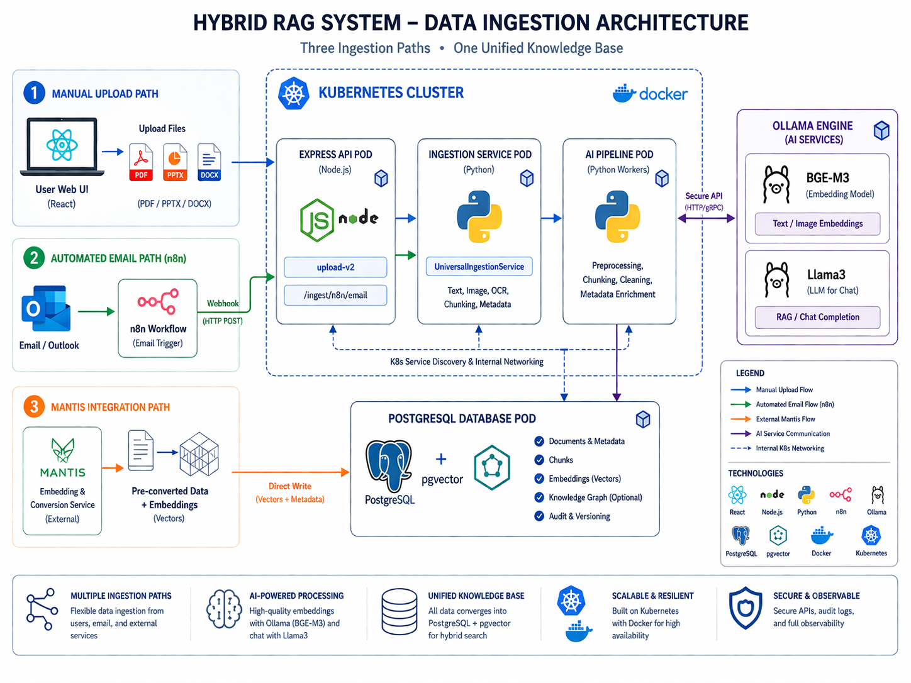
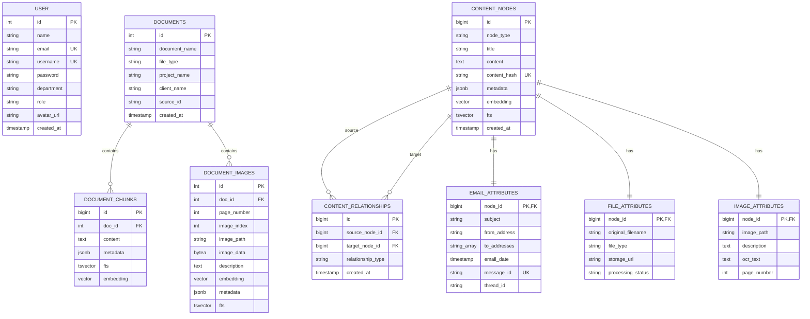

# Vector Docs: Enterprise Retrieval-Augmented Generation (RAG) System

This repository contains a comprehensive document management and intelligent knowledge retrieval system. It leverages large language models and vector search technologies to provide accurate, context-aware responses based on organizational documentation.

---

## System Architecture

The following diagram illustrates the high-level architecture of the system, including multi-source ingestion pipelines, AI processing layers, and the core infrastructure.



### Data Ingestion Pipelines

The system supports three distinct pathways for data entry:

1.  **Manual Document Upload**: Users can upload PDF, PPTX, and DOCX files directly through the web interface. The system performs automated text extraction and image analysis using dedicated Python parsers.
2.  **Automated Email Integration**: Inbound communications (Subject, Body, and Attachments) are captured via n8n workflows and pushed to the system through a secure webhook endpoint.
3.  **External Processed Data**: Integration with external services, such as the Mantis Embedding & Conversion service, allows for the direct ingestion of pre-processed data and embeddings into the primary database.

### AI and Processing Engine

*   **Embedding Generation**: Utilizes the BGE-M3 model for high-dimensional vectorization, ensuring superior semantic understanding and cross-lingual support.
*   **Precision Reranking**: Employs BGE-Reranker-v2-m3 to re-evaluate search results, prioritizing the most relevant information before it is presented to the generation model.
*   **Large Language Model (LLM)**: Integrates with Llama3 and Qwen models via self-hosted Ollama instances to generate factual, natural language responses.

---

## Database Schema and Entity Relations

The database is built on PostgreSQL 15 with the pgvector extension. It is designed to handle both structured relational data and high-dimensional vector embeddings.

### Entity Relationship Diagram



### Entity Relationship Description

1.  **User Table**: Manages authentication and user profiles.
    *   Fields: id, name, email, username, password, department, role, avatar_url, created_at.
2.  **Documents Table**: Acts as the parent entity for all ingested files.
    *   Fields: id, document_name, file_type, project_name, client_name, source_id, created_at.
3.  **Document Chunks Table**: Stores partitioned text segments and their corresponding vector embeddings.
    *   Fields: id, doc_id (FK), content, metadata, fts (Full-text search vector), embedding (Vector 1024).
4.  **Document Images Table**: Stores extracted images, their descriptions generated by vision models, and associated embeddings.
    *   Fields: id, doc_id (FK), page_number, image_index, image_path, image_data (BLOB), description, embedding (Vector 1024), metadata, fts.
5.  **Content Nodes (Graph Layer)**: Centralized node system for unified content management across different sources.
    *   Fields: id, node_type, title, content, content_hash, metadata, embedding, fts, created_at.
6.  **Attributes Tables**: Specialized tables (Email, File, Image attributes) that provide extended metadata for content nodes in the graph layer.

---

## Infrastructure and Deployment

The system is designed with a cloud-native approach, ensuring scalability and robustness.

*   **Frontend**: Built with React, Vite, and TypeScript for a responsive user experience.
*   **Backend**: Developed using Node.js Express and TypeScript to manage business logic and orchestrate AI services.
*   **Database**: PostgreSQL with pgvector for efficient hybrid search (Vector + Full-text).
*   **Orchestration**: Fully compatible with Kubernetes (K8s) for production environments and Docker Compose for localized development.

---

## Deployment Instructions

### 1. Database Initialization
Execute the initialization script to prepare the schema:
```bash
npm run server src/server/scripts/init_db.ts
```

### 2. Dependency Installation
```bash
# Backend and Frontend dependencies
npm install

# Python-based document extractors
pip install pymupdf python-pptx mammoth sharp
```

### 3. Execution
Start both the development server and the frontend client:
```bash
npm run dev:all
```

---

## Technical Features

*   **Hybrid Retrieval**: Combines semantic vector search with lexical full-text search using Reciprocal Rank Fusion (RRF).
*   **Vision-enhanced RAG**: Automatically analyzes and indexes visual content within documents to provide comprehensive answers.
*   **Enterprise Security**: Includes structured authentication and multi-tenant isolation via project and client filtering.

---

## License
Proprietary - AI Research Team
